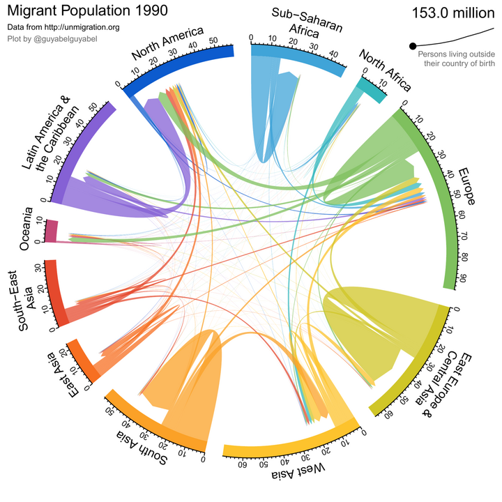
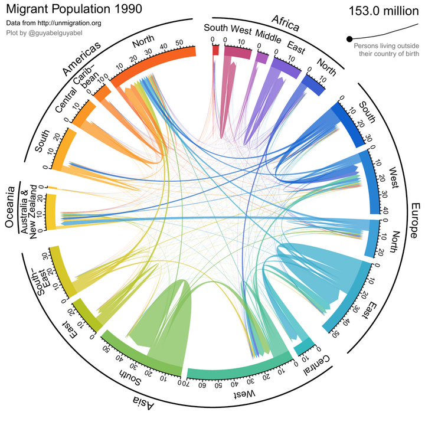

Over the last year or so I have been playing around with different ways of showing changing global bilateral migrant stocks, adapting the animation code I created for the plots for region to region flows in this estimation [paper](https://www.nature.com/articles/s41597-019-0089-3). I am putting them online here in case they are of interest to anyone else. Feel free to download the plots using right click over the animation and then `Save Video as` or from [Github](https://github.com/guyabel/personal-site/tree/master/static/img/cd-stock-global).

## Global migrant populations from 1990 to 2020

The first plot below shows the change over time in the pattern of global migrant stocks. As with the [regional plots](http://guyabel.com/post/migrant-stock-chord-digrams) in my previous post, the chords in the diagrams represent the connection between the places of birth (at the base of the chord) and places of residence (at the arrow head of the chord). The width of based of the chords correspond to the size of the migrant population in millions. Chords are ordered relative to their size, with the largest migrant stocks plotted at the beginning of the region segments. The ordering of chords jumps around over time as the relative rankings of the largest foreign-born populations change in each region. Values for the migrant population sizes are from the ~~2019~~ 2020 revision of the United Nations DESA [International Migrant Stock Data](https://www.un.org/development/desa/pd/content/international-migrant-stock). 

Note: you might have to right click, select show controls and hit play to start the animations depending on your browsers - right clicking can also allow you to access controls on the play back speed.

  <ol class="carousel-indicators">
    <li data-target="#carousel_time" data-slide-to="0" class="active">Areas</li>
    <li data-target="#carousel_time" data-slide-to="1">Regions</li>
  </ol>
  

    

      
      <video id="carousel_time_v1" loop="loop" width="720" height="720" controls muted playsinline preload="none" style="display:none" src="area-time-abel.mp4" type="video/mp4" />

    

      
      <video id="carousel_time_v2" loop="loop" width="720" height="720" controls muted playsinline preload="none" style="display:none" src="region-time-abel.mp4" type="video/mp4" />
    

  

 

