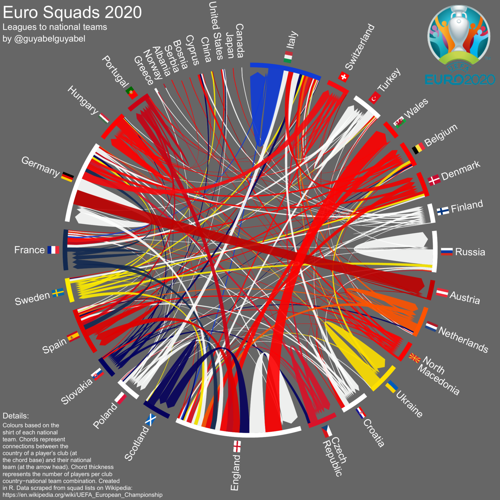

I have been playing around with [rvest](https://rvest.tidyverse.org/) once again, and decided to extend some old [code](https://gjabel.wordpress.com/2016/06/15/euro-2016-squads/) to put together a data base on the squads at past European Championships from [Wikipedia](https://en.wikipedia.org/wiki/UEFA_Euro_2020_squads). I wanted to use the chordDiagram() function in the [circlize](https://jokergoo.github.io/circlize_book/book/the-chorddiagram-function.html) package in R to illustrate the links between the league of the clubs where each national team player is represented. 

A few days ago, the squads were confirmed for Euro2020. The chords between the leagues and national teams form one big hair ball:

The chords represent connections between the country of a player's club (at the chord base) and their national team (at the arrow head). The colours of each chord in the plot are based on the shirt of each national team. Chord thickness represents the number of players per club country-national team combination. The countries are ordered by the groups that they will play in during the first round (in the animation below I order the teams by their first appearance at a tournament). The countries at the top of the diagram with no flags are leagues where the national team are not represented at the tournament, but some of clubs have players representing other national teams.

The chords coming out of each sector are ordered by size - it’s interesting to see more Austrian than German players playing in German leagues, and more Welsh than English players playing in English leagues. 

I adapted some code from animated migration [chord diagrams](https://guyabel.com/categories/chord-diagram/) to provide a history of the relationships between the club leagues of the players and the national team squads at each European Championship. In most of the early tournaments almost all the players came from clubs in their home country. Slowly you can see the increasing amount of national team players coming from clubs abroad and the expansion of the number of teams in the tournament. 

<video loop="loop" controls>
  <source src="abel-euro.mp4" type="video/mp4" />
</video>

Note: you might have to right click, select show controls and hit play to start the animations depending on your browsers - right clicking can also allow you to access controls on the play back speed.

## R Code

I put the data and all the R code to scrape the squads, flags, kit colours and tournament logos in a Github [repository](https://github.com/guyabel/uefa-ec). The R code to produce the plot and animation are also in the repository.
