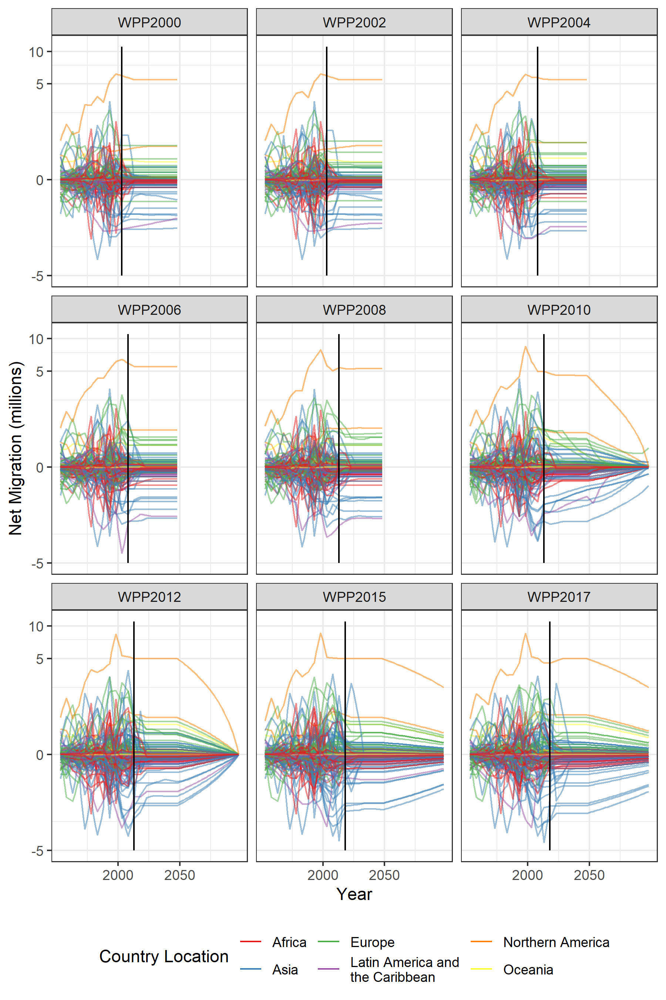
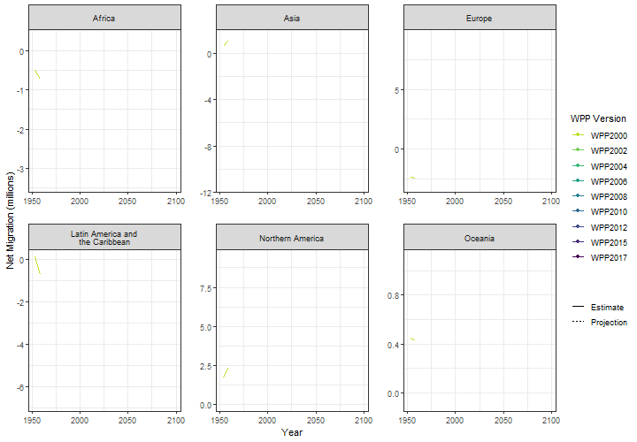

+++
title = "Non-zero trajectories for long-run net migration assumptions in global population projection models"
date = "2018-05-16"

# Authors. Comma separated list, e.g. `["Bob Smith", "David Jones"]`.
authors = ["Guy J. Abel"]

# Publication type.
# Legend:
# 0 = Uncategorized
# 1 = Conference proceedings
# 2 = Journal
# 3 = Work in progress
# 4 = Technical report
# 5 = Book
# 6 = Book chapter
publication_types = ["2"]

# Publication name and optional abbreviated version.
publication = "In *Demographic Research*, 38 (54) 1635–1662."
publication_short = ""

# Abstract and optional shortened version.
abstract = "Little attention is given to the role of migration in global population projection models. Most demographers set future levels of net migration on trajectories towards zero in all countries, nullifying the impact of migration on long-run projected populations. Yet as fertility and mortality rates fall, the role of migration on future population change is becoming more pronounced. In this paper we develop future long-run migration scenarios to provide a range of possible outcomes. Our alternative migration scenarios are linked to the Shared Socioeconomic Pathways (SSP), widely used in research on global environmental change. These are utilized as inputs for a global cohort component projection model to obtain population totals up until 2100 for all countries. The results illustrate the important role of migration assumptions in long run projections, especially in post demographic transition countries. Further, they provide plausible alternatives to projections based on the commonly used, but poorly justified, convergence to the zero net migration assumption"

# Featured image thumbnail (optional)
image_preview = ""

# Is this a selected publication? (true/false)
selected = false

# Projects (optional).
#   Associate this publication with one or more of your projects.
#   Simply enter the filename (excluding '.md') of your project file in `content/project/`.
projects = ["global-migration-prediction"]

# Links (optional).
url_pdf = "https://www.demographic-research.org/volumes/vol38/54/default.htm"
url_preprint = ""
url_code = ""
url_dataset = ""
url_project = ""
url_slides = ""
url_video = ""
url_poster = ""
url_source = ""

# Custom links (optional).
#   Uncomment line below to enable. For multiple links, use the form `[{...}, {...}, {...}]`.
# url_custom = [{name = "", url = ""}]

# Does the content use math formatting?
math = true

# Does the content use source code highlighting?
highlight = true

# Featured image
# Place your image in the `static` folder and reference its filename below, e.g. `image = "example.jpg"`.
[header]
image = "headers/dr-net-abel-ssp.png"
caption = "Non-zero trajectories for long-run net migration assumptions in global population projection models"

+++

## Further Notes

Below are some plots that I had to drop from the paper. Some reviewers liked them, reviewer three didn’t. The editor sided with the later, making a good point; they distracted from the main narrative of the paper. I have put them here as 1) I think they still might be of interest to some and 2) it took some effort to gather the net migration data from as many past versions of the World Population Prospects (WPP) as I could get my hands on.

The first plot shows estimates and future assumptions of net migration for all countries, as published by the United Nations DESA in past and current WPP.
     

With this plot I was trying to illustrate the differences between the volatile past estimates and the more regular future assumptions. It also shows how the assumption making has evolved to cover a longer period (up to 2100 from WPP2010 on-wards) and the use of the long run zero net migration trajectory, an assumption that seems to me to be overly complex given we know nothing about migration in the long run.

The second plot slices the past data and future assumption a different way - looking at revisions in the WPP for each continent. These plots are similar to those that [Shaw (2007)](http://webarchive.nationalarchives.gov.uk/20160108034027/http://www.ons.gov.uk/ons/rel/population-trends-rd/population-trends/no--128--summer-2007/fifty-years-of-united-kingdom-national-population-projections--how-accurate-have-they-been-.pdf) used to illustrate assumption drift in the ONS national population projections.

The assumptions in the past WPP also exhibit some drift, with assumptions for future net migration commonly immediately turning towards lower levels - where later observed estimates go on to show that a persistence assumption (without the turning point) would have been more accurate - see for example Africa or Europe.